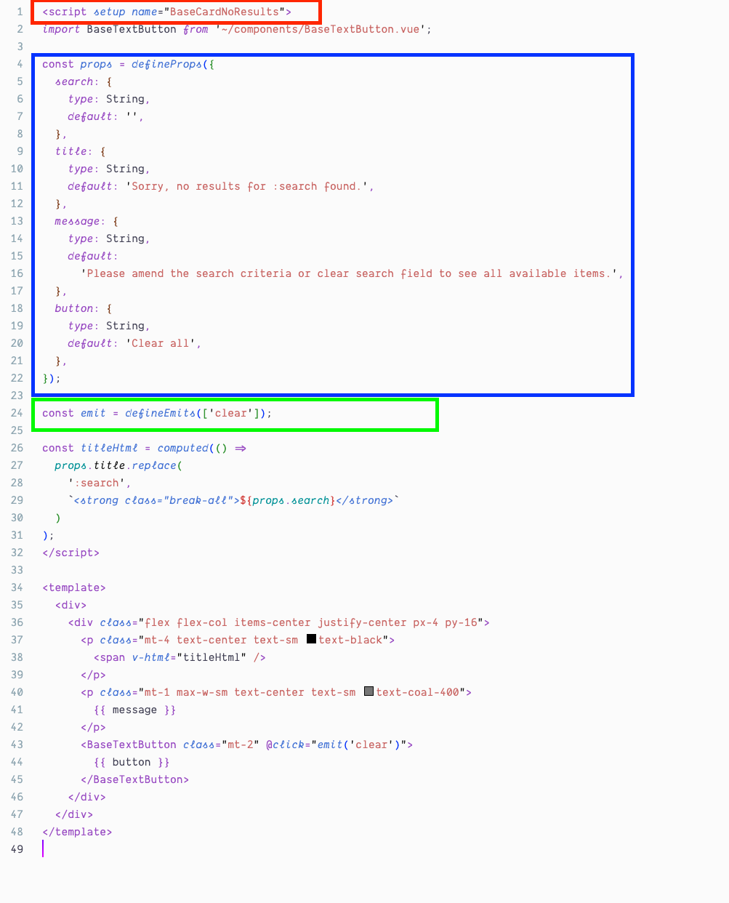
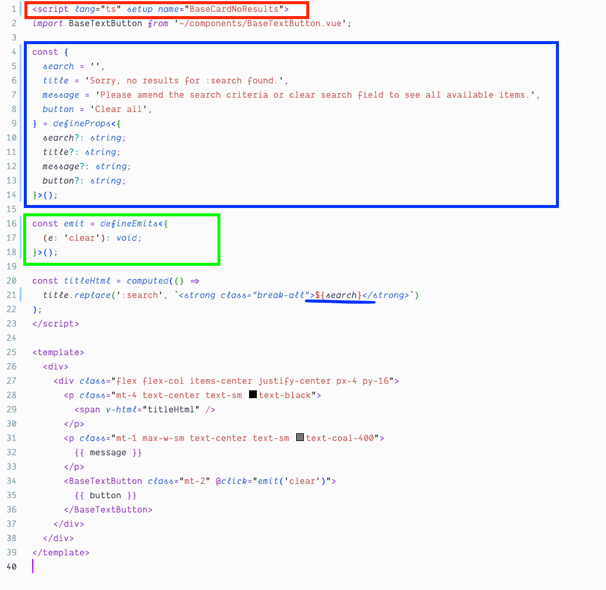

# reiz-vue-utils README

## Features

### Vue 3: Convert to Typescript

Convert your `<script setup>` Vue components to typescript before:

After you run `Vue 3: Convert to Typescript` this will happen:

## Known Issues

Calling out known issues can help limit users opening duplicate issues against your extension.

## Release Notes

Users appreciate release notes as you update your extension.

### 0.0.1

Initial release of `reiz-vue-utils`

---
